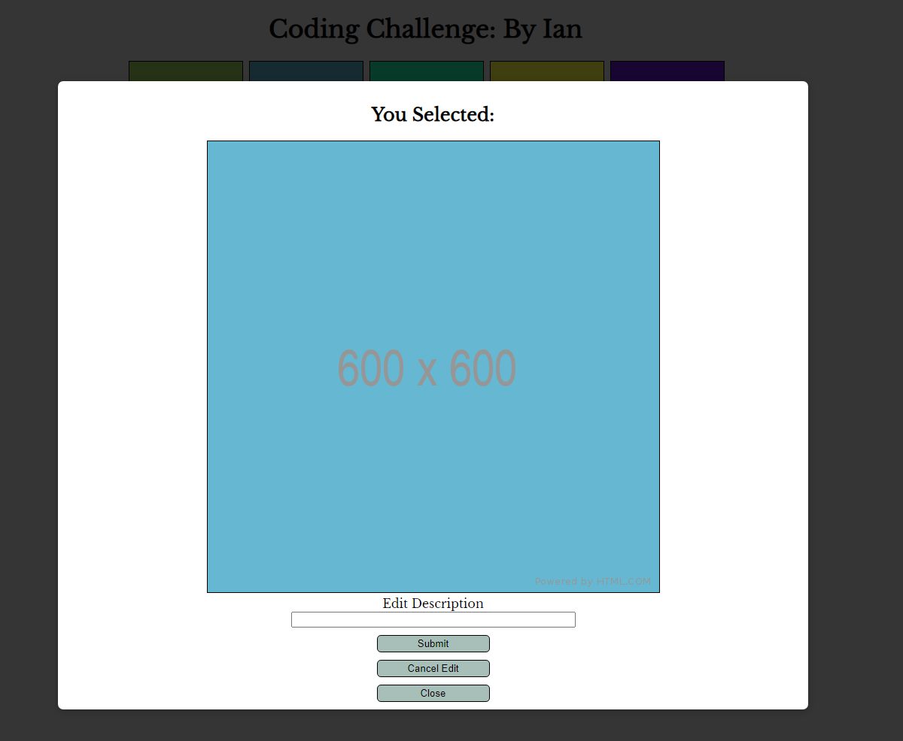

# Label Insights Coding Challenge

The Challenge was to create a grid of images from an API:
https://jsonplaceholder.typicode.com/photos

Turn it into a 5x5 grid, and create a modal that displays the full photo and allows a user to add a description

This is currently a desktop only application - will be working on making it more mobile friendly in the
future

## To run

Regardless of it you got this from a .zip or a gitHub, it's a simple npm i/npm start.  Node version 12.20.0

## Application Screenshots

## Technology Used

React (with Hooks) created with the create-react-app package with the typescript template (for native
proptype validation)

## Contact

Hello!  If you like what you have seen here and want to get in touch I can be
contacted at ian@rbruns.com